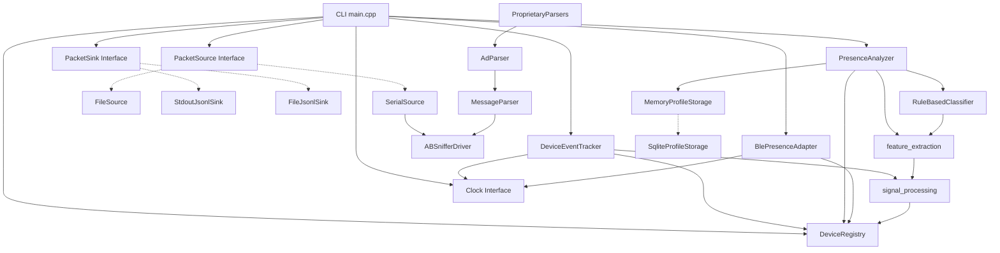
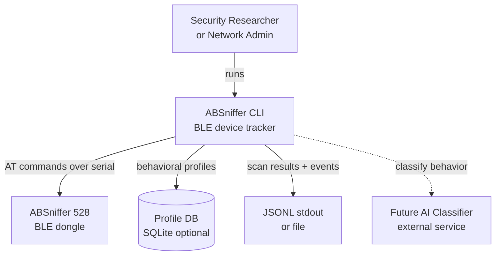
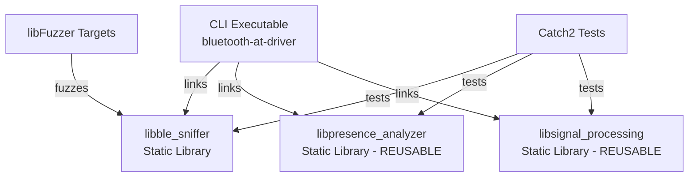
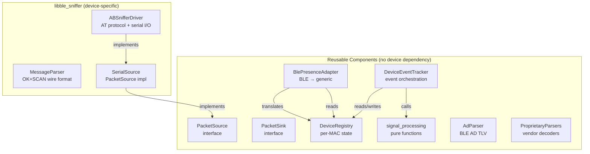
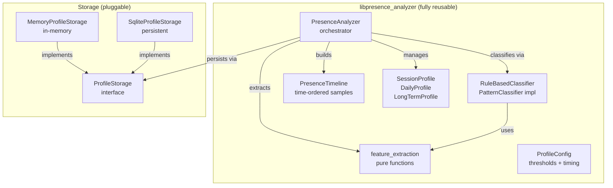
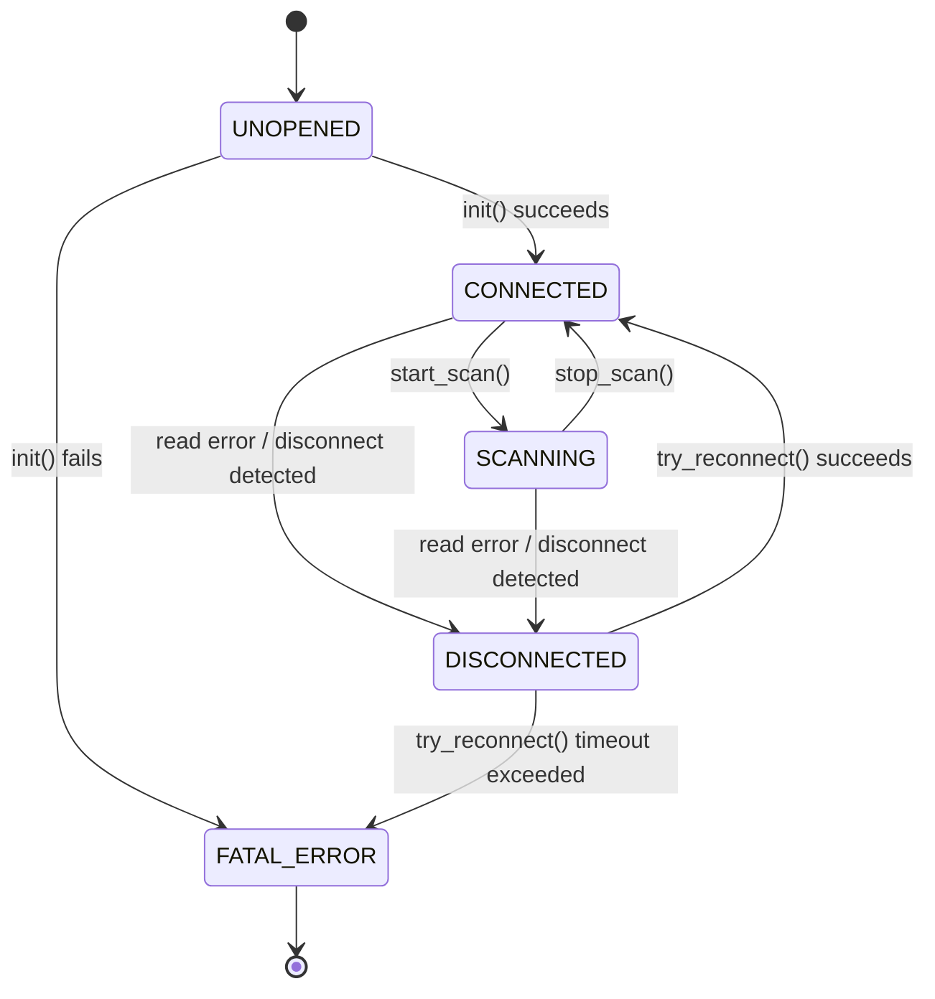

# AGENTS.md

## Project Overview

C++17 library + CLI tool for communicating with an ABSniffer 528 BLE sniffer over serial using AT commands. The library (`libble_sniffer`) is separate from the CLI executable.

## Build System

- **Package manager:** Conan 2 (`conanfile.py`)
- **Build tool:** CMake with Conan presets
- **C++ standard:** C++17

### Commands

```bash
# Install dependencies
conan install . --build=missing -s build_type=Debug

# Configure + build
cmake --preset conan-debug
cmake --build --preset conan-debug

# Release
conan install . --build=missing -s build_type=Release
cmake --preset conan-release
cmake --build --preset conan-release
```

**Important:** Never use bare `cmake ..` — always use presets or pass `-DCMAKE_BUILD_TYPE=<type>` with the Conan toolchain file.

### Adding a dependency

1. Add `self.requires("pkg/version")` to `conanfile.py` `requirements()` method
2. Add `find_package(Pkg REQUIRED)` and `target_link_libraries(ble_sniffer ...)` to `CMakeLists.txt`
3. Re-run `conan install` then rebuild

## Project Structure

```
include/ble_sniffer/           # Public API headers (installed with library)
├── types.h                    # Enums, constants, AT command strings, utilities
├── messages.h                 # Message structs (RawMessage, ScanResultMessage, etc.)
└── bluetooth_at_driver.h      # BluetoothATDriver class (serial I/O)

src/
├── messages.cpp               # Message parsing implementation
├── bluetooth_at_driver.cpp    # Serial driver implementation
└── main.cpp                   # CLI executable (links library + CLI11)
```

- `ble_sniffer` is a static library with public includes in `include/`
- `bluetooth-at-driver` is the CLI executable, links `ble_sniffer` + `CLI11`
- CLI11 is only a dependency of the executable, not the library

## Code Conventions

### Namespace
All library code lives in `namespace ble_sniffer`.

### Immutable message structs
- Fields are `protected` (accessible to derived types) with `const` getters
- Construction only through static factory methods (`parse()`, `from()`, `no_data()`, `error()`)
- Derived message types (e.g. `ScanResultMessage`) inherit from `RawMessage` and add typed fields

### Enums
- Use `enum class` with explicit underlying type (`int`)
- Parameter enums map directly to AT command integer values
- Provide a `*_to_string()` free function for human-readable conversion

### AT commands
- Stored as `inline constexpr std::string_view`
- Parameters are appended directly (no separator): `"AT+BAUD" + "4"` → `"AT+BAUD4"`
- All commands terminated with `\r\n` (handled by `send_command`)

### Documentation
- Use Doxygen-style comments (`/** */`, `@brief`, `@param`, `@return`)
- Every module, struct, and public function must have an `@example` block
- Comments describe **what**, not **how**
- Reference the AT command wiki: https://wiki.aprbrother.com/en/AT_Commands_For_ABSniffer_528.html

### Naming
- Files: `snake_case` (e.g. `bluetooth_at_driver.cpp`)
- Classes/structs: `PascalCase` (e.g. `BluetoothATDriver`, `ScanResultMessage`)
- Functions/methods: `snake_case` (e.g. `read_line`, `query_status`)
- Private members: `m_` prefix (e.g. `m_mac_address`)
- Constants: `UPPER_SNAKE_CASE` for delimiters, `PascalCase` for AT commands

### Error handling
- Serial errors return sentinel messages (`RawMessage::error()`, `RawMessage::no_data()`)
- Check `msg.type()` before accessing data
- Failed `init()` sets `file_descriptor = -1`

## Testing

Run from project root:
```bash
./build/Debug/bluetooth-at-driver --help
./build/Debug/bluetooth-at-driver -i          # device info
./build/Debug/bluetooth-at-driver -s          # scan (Ctrl+C to stop)
./build/Debug/bluetooth-at-driver -s -vv      # scan with full detail
./build/Debug/bluetooth-at-driver --stop-scan # stop scanning
```

## Architecture Principles

### Clean Architecture

- **Module boundaries are enforced.** Inner modules never depend on outer modules. Dependency arrows always point inward.
- **Device-specific code is isolated.** `ABSnifferDriver` and `MessageParser` are the only modules that know about the ABSniffer 528 wire format. All other modules operate on generic types (`DeviceObservation`, `Event`, `PacketSource`, `PacketSink`).
- **Reusable modules have no device dependency.** `DeviceEventTracker`, `DeviceRegistry`, `PresenceAnalyzer`, `AdParser`, `ProprietaryParsers`, and `signal_processing` must compile without including any ABSniffer header. They operate on generic types (`DeviceId`, `PresenceSample`, `PresenceFeatures`).
- **Dependency injection over hard-wiring.** Clocks, registries, sinks, sources, and classifiers are injected, not created inside. No `new` or `std::make_unique` of dependencies inside business logic.
- **Adapter layers translate between domains.** `BlePresenceAdapter` is the only module that knows about both BLE-specific types and generic presence types. It is a pure translation layer — no logic, no state.

### SOLID Principles

- **S — Single Responsibility:** Each module has one job. `DeviceRegistry` tracks state; `DeviceEventTracker` detects transitions; `PresenceAnalyzer` classifies behavior; `PacketSink` writes output; `PacketSource` reads input. No module does two of these.
- **O — Open/Closed:** New event types, new packet sources, new packet sinks, new vendor parsers, new classification algorithms (rule-based → AI) — all without modifying existing code. Add new implementations of existing interfaces.
- **L — Liskov Substitution:** Any `PacketSource` can replace any other (`SerialSource`, `FileSource`). Any `PacketSink` can replace any other (`StdoutJsonlSink`, `FileJsonlSink`). Any `PatternClassifier` can replace any other (`RuleBasedClassifier`, future `AIClassifier`).
- **I — Interface Segregation:** `PacketSource` has 3 methods (`read_line`, `is_exhausted`, `start`). `PacketSink` has 2 methods (`write`, `flush`). `DeviceRegistry` has no event logic. No fat interfaces.
- **D — Dependency Inversion:** CLI depends on `PacketSink` (abstraction), not `StdoutJsonlSink` (concrete). `DeviceEventTracker` depends on `DeviceRegistry` (abstraction), not a concrete LRU table. `PresenceAnalyzer` depends on `PatternClassifier` (abstraction), not `RuleBasedClassifier` (concrete). Clock is injectable.

### DRY Principles

- **No duplicate state tracking.** `DeviceRegistry` is the single source of truth for per-MAC state. `--stat` and `--events` share the same registry instance. Signal processing state (EMA, hysteresis) lives in the registry alongside device data.
- **No duplicate parsing.** `AdParser` parses BLE AD structures once. `ProprietaryParsers` decode vendor data from the parsed result. No re-parsing at the CLI level.
- **No duplicate output formatting.** `PacketSink` handles serialization. CLI says "write this event to this sink" — never formats JSON in two places.
- **No duplicate classification logic.** `signal_processing` namespace provides pure functions for EMA, hysteresis, and debounce. `PresenceAnalyzer` provides feature extraction and classification. These are never inlined elsewhere.

### Test-Driven Development

- **Every module must be testable in isolation.** If a module requires a serial port, it depends on a `SerialPort` interface (not termios). If it requires time, it depends on an injectable `Clock` (not `std::chrono::system_clock`). If it requires storage, it depends on a `ProfileStorage` interface (not SQLite).
- **Test first, implement second.** Unit tests are written before the implementation. Catch2 v3 is the test framework. `MockSerialPort` is the primary test double for serial I/O. `MockClock` is the primary test double for time.
- **Fuzz targets exist for all parsers.** `RawMessage::parse()`, `parse_ad_structures()`, and `decode_proprietary()` have libFuzzer entry points compiled conditionally with Clang.
- **Pure functions are preferred.** `signal_processing::update_ema()`, `signal_processing::check_hysteresis()`, `signal_processing::check_debounce()`, and `feature_extraction::extract_presence_features()` are pure functions with no state — the easiest code to test and reuse.

## Module Architecture

### Module Dependency Graph (Mermaid)



### C4 Model — Level 1: System Context



### C4 Model — Level 2: Container



### C4 Model — Level 3: Component (libble_sniffer)



### C4 Model — Level 3: Component (libpresence_analyzer)



### Module Dependency Rule

**Arrows never point outward.** Inner modules are more reusable and have fewer dependencies.

```
┌─────────────────────────────────────────────────────────────────┐
│  CLI (main.cpp) — wires everything together, knows all modules  │
├─────────────────────────────────────────────────────────────────┤
│  Adapters: BlePresenceAdapter, SerialSource, FileSource          │
│  (translate between device-specific and generic types)          │
├─────────────────────────────────────────────────────────────────┤
│  Orchestrators: DeviceEventTracker, PresenceAnalyzer            │
│  (coordinate between pure functions and state)                  │
├─────────────────────────────────────────────────────────────────┤
│  State: DeviceRegistry, PresenceTimeline, ProfileStorage        │
│  (single source of truth for data)                             │
├─────────────────────────────────────────────────────────────────┤
│  Pure Logic: signal_processing, feature_extraction             │
│  (no state, no I/O, maximally reusable and testable)           │
├─────────────────────────────────────────────────────────────────┤
│  Interfaces: PacketSource, PacketSink, Clock, PatternClassifier│
│  (abstraction contracts — no implementation)                   │
└─────────────────────────────────────────────────────────────────┘
```

## Module Documentation

### Documentation Standard

Every module has a doc file in `docs/modules/<name>.md` with the following sections:

1. **Responsibility** — One-sentence description of what this module does and does not do.
2. **Architecture** — Where it sits in the dependency graph. What it depends on. What depends on it. Mermaid diagram showing its position.
3. **Interface** — Public API with signatures and contracts. Pre-conditions and post-conditions.
4. **State Machine** — (If applicable) States, transitions, invariants, and guarantees. Mermaid state diagram.
5. **Examples** — Usage patterns for common scenarios. Must compile and produce the documented output.
6. **Test Strategy** — How to test this module in isolation. Mock boundaries listed. Pure functions require zero mocks.
7. **Reusability** — Can this module be used in another project? What are the portability requirements? Which other signal types (WiFi, Zigbee, etc.) could use it?

### Required Module Docs

| Module | Doc File | Has State Machine? | Reusable? |
|--------|----------|--------------------|-----------|
| `ABSnifferDriver` | `bluetooth-at-driver.md` | Yes (UNOPENED→CONNECTED→SCANNING→DISCONNECTED→FATAL_ERROR) | No (device-specific) |
| `PacketSource` | `packet-source.md` | Yes (IDLE→STARTED→EXHAUSTED) | Yes |
| `PacketSink` | `packet-sink.md` | No | Yes |
| `DeviceRegistry` | `device-registry.md` | Yes (per-MAC lifecycle) | Yes |
| `DeviceEventTracker` | `device-event-tracker.md` | No (stateless orchestrator) | Yes |
| `signal_processing` | `signal-processing.md` | No (pure functions) | Yes — any signal processing |
| `PresenceAnalyzer` | `presence-analyzer.md` | Yes (session→daily→longterm profile progression) | Yes — any device tracker |
| `feature_extraction` | `feature-extraction.md` | No (pure functions) | Yes — any time-series analysis |
| `PatternClassifier` | `pattern-classifier.md` | No (interface + rule impl) | Yes — pluggable |
| `ProfileStorage` | `profile-storage.md` | Yes (memory→disk tiering) | Yes |
| `BlePresenceAdapter` | `ble-presence-adapter.md` | No (pure translation) | Yes — any BLE project |
| `MessageParser` | `message-parser.md` | Yes (parsing state machine) | No (ABSniffer wire format) |
| `AdParser` | `ad-parser.md` | No (stateless parser) | Yes — any BLE project |
| `ProprietaryParsers` | `proprietary-parsers.md` | No (stateless decoders) | Yes — any BLE project |
| `Types` | `types.md` | No | No (ABSniffer-specific enums) |

### Mermaid Diagram Requirements

All architecture diagrams in module docs and ADRs MUST use Mermaid syntax for:

- **State machines:** `stateDiagram-v2` for module state machines (e.g., BluetoothATDriver states, PacketSource lifecycle)
- **Component dependencies:** `graph TD` or `graph LR` for module dependency graphs showing which module depends on which
- **C4 levels:** Use Mermaid `graph` with styled subgraphs for Context, Container, and Component views. Label nodes with `name: description` format.

C4-style granularity levels:

| Level | Name | Shows | Mermaid type |
|-------|------|-------|-------------|
| 1 | System Context | External actors and systems | `graph TB` with actor boxes |
| 2 | Container | Executables, libraries, databases | `graph TB` with subgraphs |
| 3 | Component | Modules within a container | `graph TD` with subgraphs per container |
| 4 | Code | Classes and functions | `classDiagram` or `graph TD` for small scopes |

Every module doc MUST include at minimum a Level 3 (Component) diagram showing where it sits relative to its direct dependencies and dependents.

### State Machine Documentation

State machines MUST be documented using Mermaid `stateDiagram-v2` with:

- All states listed with entry conditions
- All transitions with trigger events
- Invariants that hold in each state (e.g., "is_open() returns true only in CONNECTED or SCANNING")
- Error transitions explicitly shown (not just happy path)
- State that is valid in each state (e.g., "m_file_descriptor >= 0 in CONNECTED, < 0 in UNOPENED")

Example format:



## Signal Types and Multi-Protocol Reuse

The `presence_analyzer`, `signal_processing`, `feature_extraction`, `DeviceRegistry`, and `ProfileStorage` modules are designed for reuse across signal types:

| Module | BLE use | WiFi use | Zigbee use | Generic use |
|--------|---------|----------|------------|-------------|
| `signal_processing` | RSSI smoothing | RSSI smoothing | LQI smoothing | Any numeric signal |
| `feature_extraction` | BLE presence features | WiFi probe features | Zigbee join/leave | Any time-series |
| `PresenceAnalyzer` | BLE device tracking | WiFi MAC tracking | Zigbee device tracking | Any device tracker |
| `PatternClassifier` | BLE behavior | WiFi behavior | Zigbee behavior | Any pattern |
| `DeviceRegistry` | BLE per-MAC | WiFi per-MAC | Zigbee per-addr | Any per-ID state |
| `ProfileStorage` | BLE profiles | WiFi profiles | Zigbee profiles | Any profiles |

To reuse for WiFi:
1. Write `WiFiDriver : public PacketSource` (replaces `SerialSource`)
2. Write `WiFiParser` → `DeviceObservation` (replaces `MessageParser`)
3. Write `WiFiPresenceAdapter` (replaces `BlePresenceAdapter`)
4. Reuse everything else unchanged

## Behavioral Analysis: Multi-Scale Profiles

The `PresenceAnalyzer` classifies devices across three time scales:

| Scale | Duration | Profile Type | Storage | Confidence |
|-------|----------|-------------|---------|------------|
| Session | 15min–1hr | `SessionProfile` | Memory | LOW (0.2–0.8) |
| Daily | 1–7 days | `DailyProfile` | Memory + optional DB | MODERATE (0.6–0.8) |
| Long-term | 7+ days | `LongTermProfile` | Database (SQLite) | HIGH (0.8–0.95) |

Confidence degrades gracefully: a 15-minute session can only classify `FIXED_DEVICE` (high confidence) or `PASSING_DEVICE` (low confidence) or `UNKNOWN` (insufficient data). Daily data adds `SCHEDULED_DEVICE` and `RESIDENTIAL_DEVICE`. Long-term data adds high-confidence periodicity detection.

Classification types:

| Behavior | Key Features | Min Data Needed |
|----------|-------------|-----------------|
| `FIXED_DEVICE` | duty_cycle ≈ 1.0, signal_variance < 2 dB² | 1 session |
| `PASSING_DEVICE` | duty_cycle < 0.1, 1–2 sessions, brief | 1 session |
| `SCHEDULED_DEVICE` | 3+ short sessions/day, regular times | 1+ days |
| `RESIDENTIAL_DEVICE` | duty_cycle 0.3–0.8, morning-absent/evening-present | 2+ days |
| `INTERMITTENT_DEVICE` | no clear pattern | 3+ days |
| `UNKNOWN` | insufficient observations | any |

The `PatternClassifier` interface is pluggable: `RuleBasedClassifier` is the current implementation, with an `AIClassifier` extension point for future AI-based analysis.
