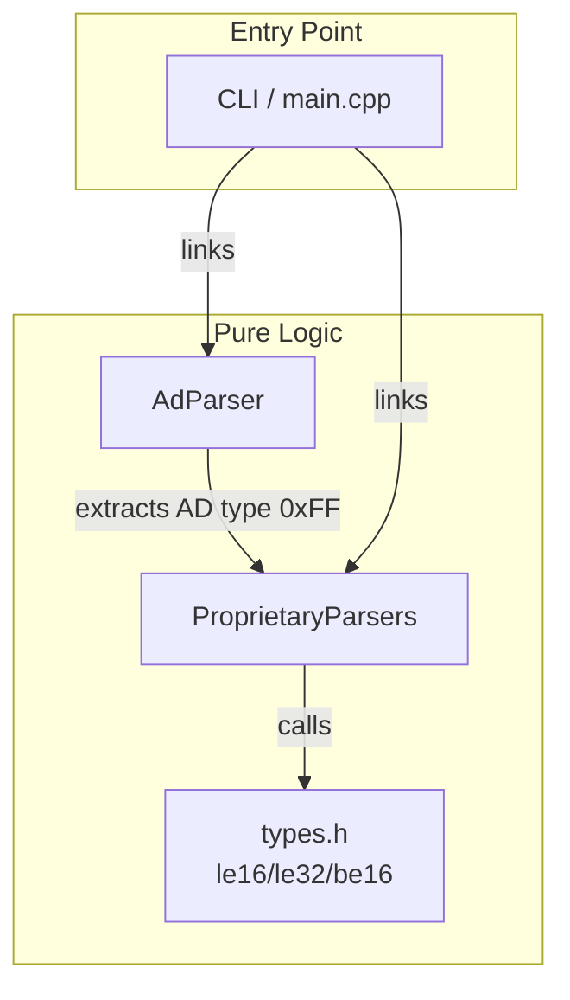

# Module: Proprietary Parsers

## Responsibility

Decodes vendor-specific BLE Manufacturer Specific Data (AD type 0xFF) into human-readable descriptions and field values. Routes parsing to the correct vendor handler based on the Bluetooth SIG company identifier. Does **not** parse BLE AD structures — that is the responsibility of `AdParser`.

## Architecture

The `proprietary` module sits in the **Pure Logic** layer of the architecture — it depends only on standard library types and `types.h` (for `le16()`/`le32()`/`be16()` helpers). It has no dependency on serial I/O, hardware, or platform code.

### Component Diagram



### Dependency Table

| Depends On | Type | Reason |
|------------|------|--------|
| `types.h` (`le16()`, `le32()`, `be16()`) | Header-only | Byte-order helpers for multi-byte field parsing |
| `<cstdint>`, `<optional>`, `<string>`, `<vector>` | Standard library | Core types |

| Depended On By | Type | Reason |
|----------------|------|--------|
| `AdParser` | Module | Extracts manufacturer-specific data and calls `decode_proprietary()` |
| CLI | Module | Displays decoded vendor data in output |

### Reusability

**Fully reusable** — any BLE project that needs to decode vendor-specific manufacturer data. The module has zero platform dependencies, zero hardware dependencies, and only depends on standard library types and the `le16()`/`le32()`/`be16()` helpers.

For a different BLE project:
1. Copy `proprietary_parsers.h` and `proprietary_parsers.cpp`
2. Ensure `types.h` (or equivalent) provides `le16()`, `le32()`, `be16()`
3. Use `decode_proprietary()` / `decode_proprietary_parts()` with the company ID and payload

For non-BLE protocols (WiFi, Zigbee): not directly reusable, but the pattern of routing by vendor ID to specialized parsers is transferable.

## Interface

### Public Types

| Type | Description |
|------|-------------|
| `ParseResult` | Struct with `description` (label, e.g. "AirPods") and `details` (field values) |

### Vendor Parsers (per namespace)

| Function | Company ID | Reliability | See |
|----------|-----------|-------------|-----|
| `apple::parse(vector<uint8_t>)` | 0x004C | High | [continuity](https://github.com/furiousMAC/continuity), [openhaystack](https://github.com/seemoo-lab/openhaystack) |
| `samsung::parse(vector<uint8_t>)` | 0x0075 | Medium | ADR-0006 |
| `microsoft::parse(vector<uint8_t>)` | 0x0006 | High | [Swift Pair spec](https://learn.microsoft.com/en-us/windows-hardware/design/component-guidelines/bluetooth-swift-pair) |
| `sony::parse(vector<uint8_t>)` | 0x012D | Low | ADR-0009 |
| `sonos::parse(vector<uint8_t>)` | 0x05A7 | Low | Best-effort |
| `garmin::parse(vector<uint8_t>)` | 0x0087 | Low | Best-effort |
| `razer::parse(vector<uint8_t>)` | 0x068E | Low | ADR-0009 |
| `furbo::parse(vector<uint8_t>)` | 0x3030 | Low | ASCII payload |

### Routing Functions

| Function | Signature | Returns |
|----------|-----------|---------|
| `decode_proprietary` | `(uint16_t company_id, vector<uint8_t> payload)` | `optional<string>` |
| `decode_proprietary` | `(vector<uint8_t> mfr_ad_data)` — convenience wrapper, extracts 2-byte company ID prefix | `optional<string>` |
| `decode_proprietary_parts` | `(uint16_t company_id, vector<uint8_t> payload)` | `optional<ParseResult>` |
| `decode_proprietary_parts` | `(vector<uint8_t> mfr_ad_data)` — convenience wrapper | `optional<ParseResult>` |

### Pre-conditions

- `payload` / `mfr_data` buffers must be validated for sufficient length by callers
- `company_id` must be a valid Bluetooth SIG company identifier
- `decode_proprietary()` convenience overload requires `mfr_ad_data.size() >= 2` (company ID prefix)

### Post-conditions

- Returns `std::nullopt` for unrecognised company IDs
- Returns `std::nullopt` if payload is empty (vendor-dependent)
- Returns `ParseResult` with description string for valid data; returns result with raw hex even for truncated/incomplete data (graceful degradation)

## State Machine

Not applicable — all parsers are stateless pure functions. Input → parse → output. No mutable state, no side effects.

## Examples

### Decode Known Vendor Data

```cpp
#include <ble_sniffer/proprietary_parsers.h>

// AirPods manufacturer data (company ID 0x004C = Apple)
std::vector<uint8_t> payload = {0x07, 0x04, 0x00, 0x02, 0x00, 0x00, 0x55, 0x05};
auto result = ble_sniffer::proprietary::apple::parse(payload);
if (result) {
    std::cout << result->description << std::endl;  // "AirPods"
    std::cout << result->details << std::endl;       // "len=4 model=0x02 L=50% (raw=5) ..."
}
```

### Route by Company ID

```cpp
// Auto-route to correct vendor parser
auto result = ble_sniffer::proprietary::decode_proprietary_parts(0x004C, payload);
std::cout << result->description << ": " << result->details << std::endl;
// Output: "AirPods: len=4 model=0x02 ..."
```

### Decode from Raw AD Data

```cpp
// Raw AD data includes 2-byte company ID prefix at offset 0
std::vector<uint8_t> ad_data = {0x4C, 0x00, 0x07, 0x04, 0x00, 0x02, 0x00, 0x00, 0x55, 0x05};
auto str = ble_sniffer::proprietary::decode_proprietary(ad_data);
// Uses convenience overload — extracts company ID, routes, formats as string
```

### Handle Unknown Vendors

```cpp
// Unknown company ID returns nullopt
auto result = ble_sniffer::proprietary::decode_proprietary_parts(0xFFFF, payload);
assert(!result.has_value());
```

## Test Strategy

### Unit Tests (Synthetic)

All vendor parsers are testable with synthetic byte vectors — no hardware or I/O required:

| Test File | Covers | Type |
|-----------|--------|------|
| `byte_order_test.cpp` | Samsung device_type LE, Sony protocol_ver LE, Razer model LE, iBeacon Major/Minor BE | Unit |
| `airpods_label_test.cpp` | AirPods battery nibble formatting (valid 0-10, out-of-range 11-15) | Unit |

### Regression Tests

- **Golden file diff:** Compare before/after scan output for known BLE advertisements to verify parser output consistency.

### Cross-Validation

- **nRF Connect for Mobile:** Compare parser output against raw bytes displayed by nRF Connect
- **nRF52840 Sniffer + Wireshark:** Cross-reference with Wireshark Continuity dissector for Apple subtypes

### Fuzz Testing

All parser entry points (`decode_proprietary()`, `decode_proprietary_parts()`, each vendor `parse()`) accept untrusted input (raw BLE advertisement data). Fuzz targets should be added for:

1. `apple::parse()` — most complex parser, 8 subtypes
2. `decode_proprietary_parts()` — routing function, exercises all vendor parsers
3. Each vendor `parse()` — edge cases with truncated/empty payloads

### Mock Boundaries

**Zero mocks required** — all parsers are pure functions operating on byte vectors. No I/O, no clock, no registry, no storage.

## Reusability

### Portability Requirements

| Requirement | Status |
|-------------|--------|
| C++ Standard | C++17 (uses `<optional>`) |
| Platform | Any (no platform-specific code) |
| Dependencies | `types.h` (`le16`, `le32`, `be16`), C++ standard library |
| Build system | Any — just add `.h` and `.cpp` to compile |

### Other Signal Types

Not directly reusable for non-BLE signals, but the architectural pattern is transferable:
- **WiFi:** A `wifi_proprietary` namespace could decode vendor-specific WiFi probe request IEs using the same routing-by-vendor-ID pattern.
- **Zigbee:** Vendor-specific ZCL clusters could use the same decode-by-manufacturer-code pattern.

## Related

- `include/ble_sniffer/proprietary_parsers.h` — public API with full Doxygen
- `src/proprietary_parsers.cpp` — implementation
- `docs/learning/ble-byte-order-conventions.md` — BLE byte order rules and helper functions
- `docs/learning/vendor-parser-reverse-engineering.md` — parser reliability ratings and validation methods
- `docs/adr/psc-adr-0006.md` — decision to add `le16()`/`le32()`/`be16()` helpers
- `docs/adr/psc-adr-0009.md` — decision to apply LE convention to Sony/Razer unverified parsers
- `docs/adr/psc-adr-0007.md` — AirPods battery output format: percentage + raw parenthetical
- `docs/adr/psc-adr-0008.md` — AirPods battery out-of-range nibble handling decision
