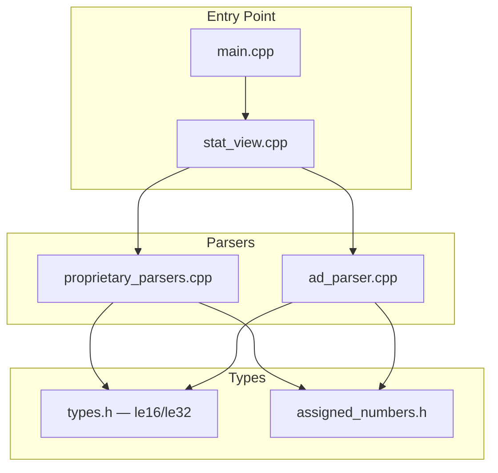

# A2-Primary: Software Engineer — Dual-Model Challenge Design Proposal

| Field | Value |
|-------|-------|
| Agent | software-engineer |
| Timestamp | 2026-06-14T22:00:00Z |
| Step | A2-Primary |
| Verdict | CONDITIONAL PASS — Design proposal complete, ready for challenger review |
| Model | deepseek-v4-pro |

---

## 1. Executive Summary

This design proposal synthesises all four A1 specialist reviews (SW, TX, DX, WX) into a comprehensive implementation plan for psc-0006. The scope has been expanded per user confirmation to include:

1. **3 byte order bug fixes** (Samsung `device_type`, Sony `protocol_ver`, Razer `model`) — all changing from big-endian to little-endian
2. **2 helper functions** (`le16()`, `le32()`) in `types.h` to prevent future byte-order bugs
3. **AirPods battery labeling** — Option C: percentage + raw parenthetical (`L=50% (raw=5)`)
4. **Out-of-range nibble handling** — Option 1: `??` for percentage, raw value always shown
5. **DRY refactoring** — 10 call sites across 4 files to use `le16()`/`le32()`
6. **Full Doxygen** — 14 public symbols in `proprietary_parsers.h` + 2 new helpers in `types.h`
7. **3 new documentation files** — 2 learning docs + 1 module doc
8. **Broken URL fixes** — 5 references to `nicedouble/AppleBLEDecoder` (404)

### User Decisions Confirmed

| Decision | Choice | Rationale |
|----------|--------|-----------|
| Scope expansion | Include ALL fixes (Samsung + Sony + Razer + DRY + docs) | All specialists agreed scope expansion is architecturally justified |
| AirPods battery labeling | Option C: `L=50% (raw=5)` | Percentage + raw parenthetical — user-friendly + debuggable |
| Out-of-range nibble handling | Option 1: `L=?? (raw=15)` | Honest about uncertainty, preserves all data |
| Sony/Razer byte order | Apply fix based on BLE convention | WX confirmed BLE Core Spec §1.3.1 mandates LE; proceed with comment noting assumption |
| Build error prerequisite | Fix `bluetooth_at_driver.cpp:105` BEFORE Phase B | **STATUS: ALREADY RESOLVED** — working tree build passes (verified 2026-06-14) |

---

## 2. Architecture Assessment

### 2.1 Module Boundaries — PASS

All changes are within the `ble_sniffer` library boundary. No hardware platform headers are introduced. The `le16()`/`le32()` helpers are pure `constexpr` functions in the lowest-level header (`types.h`), following the inward-dependency rule.

```
Entry Point (main.cpp) → Adapters (stat_view.cpp) → Parsers (ad_parser.cpp, proprietary_parsers.cpp) → Types (types.h)
                                                                                                          ↑
                                                                                              le16()/le32() live here
```

### 2.2 SOLID Principles — PASS

| Principle | Assessment |
|-----------|------------|
| **S — Single Responsibility** | `le16()`/`le32()` are single-purpose pure functions. Proprietary parsers remain focused on vendor-specific decoding. |
| **O — Open/Closed** | The `le16()`/`le32()` helpers make it trivially open to new vendors (add a new parser, use helpers). No existing code modified beyond bug fixes. |
| **L — Liskov Substitution** | Proprietary parser functions share the same signature `parse(const vector<uint8_t>&) → optional<ParseResult>`. No change needed. |
| **I — Interface Segregation** | No fat interfaces introduced. `le16()`/`le32()` are minimal — 2/4 bytes in, `uint16_t`/`uint32_t` out. |
| **D — Dependency Inversion** | The `le16()` helper is at the lowest level (types.h), which all modules can depend on. No new dependencies introduced. |

### 2.3 DRY — Previously Violated, Now Fixed

The 10 duplicate LE16 parse sites across 4 files were a DRY violation. The `le16()`/`le32()` helpers eliminate this duplication. After refactoring:

| File | Before | After |
|------|--------|-------|
| `ad_parser.cpp` | 6 inline `data[lo] \| (data[hi] << 8)` | 6 × `le16(&data[offset])` |
| `proprietary_parsers.cpp` | 1 inline company_id + 3 buggy BE reads | 1 × `le16()` + 3 × `le16()` (fixed) |
| `stat_view.cpp` | 1 inline company_id | 1 × `le16()` |
| `types.h` | 0 helpers | 2 helpers (`le16`, `le32`) |

### 2.4 Namespace Hygiene — PASS

The `le16()` and `le32()` functions are placed in `namespace ble_sniffer` (types.h), not in a vendor namespace. All existing code stays in `ble_sniffer::proprietary::` namespaces.

### 2.5 Type Design Review — `le16()`/`le32()`

| Dimension | Score | Justification |
|-----------|-------|---------------|
| Encapsulation | 10 | Pure functions, no state, no invalid states possible |
| Invariant Expression | 10 | `constexpr` — all values verified at compile time |
| Usefulness | 10 | Self-documenting: `le16(&data[1])` is immediately clear as "parse LE16 from data[1..2]" |
| Enforcement | 10 | `const uint8_t*` input, `uint16_t`/`uint32_t` output — no raw integer leakage |
| **Overall** | **10.0** | Excellent — meets all typed vocabulary standards |

---

## 3. Detailed Implementation Plan

### 3.1 File-by-File Change List

#### File 1: `include/ble_sniffer/types.h` — ADD `le16()` and `le32()`

**Location:** After the existing utility functions (after `address_to_mac_address()` declaration, before closing `}`).

**API Design:**

```cpp
/**
 * @brief Parse a little-endian 16-bit unsigned integer from a byte buffer.
 *
 * Follows the BLE Core Specification convention: the byte at the lower
 * index is the least significant byte (LSB).
 *
 * @note This is the standard byte order for all BLE multi-byte fields
 *       (company IDs, service UUIDs, appearance values, connection intervals,
 *       and manufacturer-specific data). Vendor formats that use big-endian
 *       (e.g., Apple iBeacon Major/Minor) must be handled separately.
 *
 * @param data  Pointer to at least 2 consecutive bytes. Caller is responsible
 *              for bounds checking.
 * @return      The 16-bit value in host byte order.
 *
 * @see Bluetooth Core Specification, Vol 1, Part A, Section 1
 *
 * @example
 * @code
 * const uint8_t buf[] = {0x34, 0x12};
 * uint16_t val = ble_sniffer::le16(buf);
 * // val == 0x1234
 * @endcode
 */
inline constexpr uint16_t le16(const uint8_t* data) noexcept {
    return static_cast<uint16_t>(data[0]) | (static_cast<uint16_t>(data[1]) << 8);
}

/**
 * @brief Parse a little-endian 32-bit unsigned integer from a byte buffer.
 *
 * @param data  Pointer to at least 4 consecutive bytes. Caller is responsible
 *              for bounds checking.
 * @return      The 32-bit value in host byte order.
 *
 * @example
 * @code
 * const uint8_t buf[] = {0x78, 0x56, 0x34, 0x12};
 * uint32_t val = ble_sniffer::le32(buf);
 * // val == 0x12345678
 * @endcode
 */
inline constexpr uint32_t le32(const uint8_t* data) noexcept {
    return static_cast<uint32_t>(data[0]) | (static_cast<uint32_t>(data[1]) << 8) |
           (static_cast<uint32_t>(data[2]) << 16) | (static_cast<uint32_t>(data[3]) << 24);
}
```

**Design decision — pointer vs vector+offset API:**
The SW Engineer proposed both `le16(const uint8_t*)` and `read_le16(const vector<uint8_t>&, size_t offset)`. The WX proposed `read_le16(data, offset)`. After analysis:

- **Chosen: `le16(const uint8_t* data)`** — pointer-based, no bounds checking. This is the minimal, maximally reusable form. It works with any contiguous buffer (vector, array, raw pointer). Callers are responsible for bounds checking — this is the existing pattern in all 10 call sites.
- **Rejected: `read_le16(const vector<uint8_t>&, size_t)`** — vector-specific, adds bounds-checking responsibility to the helper. This would require the helper to either throw (new failure mode) or silently return 0 (hides errors). The existing call sites already check `size() >= offset + 2` before accessing bytes — adding bounds checking in the helper would be redundant and introduce inconsistency.
- **Optional future addition: `read_be16()`** — WX recommended this for iBeacon. This is a nice-to-have but not in scope for psc-0006. The iBeacon code is correct and well-commented. Adding `read_be16()` would be a separate refactoring ticket.

#### File 2: `src/proprietary_parsers.cpp` — 3 Byte Order Fixes + AirPods Labeling + URL Fixes

**Change 1: Samsung `device_type` (line 189) — BE→LE**

```cpp
// BEFORE (buggy — big-endian):
uint16_t device_type = (static_cast<uint16_t>(mfr_data[1]) << 8) | mfr_data[2];

// AFTER (correct — little-endian):
uint16_t device_type = le16(&mfr_data[1]);  // LE per BLE Core Spec Vol 1 Part A §1
```

**Change 2: Sony `protocol_ver` (line 240) — BE→LE**

```cpp
// BEFORE (buggy — big-endian):
uint16_t protocol_ver = (static_cast<uint16_t>(mfr_data[0]) << 8) | mfr_data[1];

// AFTER (correct — little-endian):
uint16_t protocol_ver = le16(&mfr_data[0]);  // LE per BLE Core Spec Vol 1 Part A §1; not verified against Sony docs
```

**Change 3: Razer `model` (line 301) — BE→LE**

```cpp
// BEFORE (buggy — big-endian):
uint16_t model = (static_cast<uint16_t>(mfr_data[0]) << 8) | mfr_data[1];

// AFTER (correct — little-endian):
uint16_t model = le16(&mfr_data[0]);  // LE per BLE Core Spec Vol 1 Part A §1; not verified against Razer docs
```

**Change 4: AirPods Battery Labeling (lines 83-94) — Option C**

```cpp
// BEFORE:
detail << " battery L=" << static_cast<int>(left) << " R=" << static_cast<int>(right);
// ...
detail << " Case=" << static_cast<int>(case_battery)
       << " charging=0x" << std::hex << static_cast<int>(charging)
       << (lid_open ? " lid=open" : " lid=closed");

// AFTER:
// Battery level: 0-10 nibble mapped to 0%-100% in 10% increments.
// Values 11-15 are reserved/special states and display as "??".
auto format_battery = [](uint8_t nibble) -> std::string {
    if (nibble <= 10) {
        return std::to_string(nibble * 10) + "% (raw=" + std::to_string(nibble) + ")";
    }
    return "?? (raw=" + std::to_string(nibble) + ")";
};
detail << " battery L=" << format_battery(left)
       << " R=" << format_battery(right);
// ...
detail << " Case=" << format_battery(case_battery)
       << " charging=0x" << std::hex << static_cast<int>(charging)
       << (lid_open ? " lid=open" : " lid=closed");
```

**Design decision — lambda vs free function:**
The `format_battery` lambda is local to the AirPods parser. It is not a public API — it's an implementation detail of the AirPods battery formatting. Making it a lambda keeps it scoped to the single call site. If other parsers need battery formatting in the future, it can be promoted to a free function in `types.h` or a new `formatting.h`.

**Change 5: Company ID (line 340-341) — Refactor to `le16()`**

```cpp
// BEFORE:
uint16_t company_id = static_cast<uint16_t>(mfr_ad_data[0]) |
                       (static_cast<uint16_t>(mfr_ad_data[1]) << 8);

// AFTER:
uint16_t company_id = le16(&mfr_ad_data[0]);
```

**Change 6: Broken URL Fixes (5 locations)**

Replace all instances of `https://github.com/nicedouble/AppleBLEDecoder` with:
```
// Original reference (nicedouble/AppleBLEDecoder) is no longer available (404).
// Current decoding based on: https://github.com/furiousMAC/continuity
```

Locations: lines 35, 70, 99, 177, 234.

**Change 7: iBeacon Comment Clarification (line 50)**

```cpp
// BEFORE:
// Bytes 2-17 = UUID, 18-19 = Major (BE), 20-21 = Minor (BE), 22 = TX Power

// AFTER:
// Bytes 2-17 = UUID, 18-19 = Major (BE — Apple iBeacon spec, vendor exception to BLE LE convention),
// 20-21 = Minor (BE), 22 = TX Power (byte offset 22, 0-based)
```

#### File 3: `src/ad_parser.cpp` — 6 Refactoring Sites

All 6 sites change from inline `data[lo] | (data[hi] << 8)` to `le16(&data[offset])`. These are **behavior-preserving** — the existing code is already correct LE.

| Line | Field | Before | After |
|------|-------|--------|-------|
| 39-40 | Company ID | `ad.data[0] \| (ad.data[1] << 8)` | `le16(&ad.data[0])` |
| 88-89 | 16-bit UUID (loop) | `ad.data[i] \| (ad.data[i+1] << 8)` | `le16(&ad.data[i])` |
| 103-106 | 32-bit UUID (loop) | `ad.data[i] \| (ad.data[i+1]<<8) \| (ad.data[i+2]<<16) \| (ad.data[i+3]<<24)` | `le32(&ad.data[i])` |
| 144-145 | Appearance | `ad.data[0] \| (ad.data[1] << 8)` | `le16(&ad.data[0])` |
| 154-155 | CI min_interval | `ad.data[0] \| (ad.data[1] << 8)` | `le16(&ad.data[0])` |
| 156-157 | CI max_interval | `ad.data[2] \| (ad.data[3] << 8)` | `le16(&ad.data[2])` |

#### File 4: `src/stat_view.cpp` — 1 Refactoring Site

| Line | Field | Before | After |
|------|-------|--------|-------|
| 102-103 | Company ID | `ad.data[0] \| (ad.data[1] << 8)` | `le16(&ad.data[0])` |

#### File 5: `include/ble_sniffer/proprietary_parsers.h` — Full Doxygen (14 symbols)

**File-level block** (new, at top of file after `#pragma once` and includes):

```cpp
/**
 * @file proprietary_parsers.h
 * @brief Vendor-specific BLE Manufacturer Specific Data parsers.
 *
 * Decodes proprietary data formats from Apple, Samsung, Microsoft, Sony,
 * Sonos, Garmin, Razer, and Furbo devices. Most formats are reverse-engineered
 * from community references — see individual function @note tags for status.
 *
 * @note BLE multi-byte fields follow little-endian byte order per the
 *       Bluetooth Core Specification (Vol 1, Part A, Section 1). Vendor
 *       formats that deviate (e.g., Apple iBeacon Major/Minor) are documented
 *       as exceptions.
 *
 * @see https://github.com/furiousMAC/continuity (Apple Continuity protocol)
 * @see https://github.com/seemoo-lab/openhaystack (Apple Find My protocol)
 * @see https://learn.microsoft.com/en-us/windows-hardware/design/component-guidelines/bluetooth-swift-pair
 *
 * @example
 * @code
 * #include <ble_sniffer/proprietary_parsers.h>
 *
 * // Decode Apple manufacturer data
 * std::vector<uint8_t> mfr_data = {0x4C, 0x00, 0x07, 0x04, 0x00, 0x02, 0x00, 0x00, 0x55, 0x05};
 * auto result = ble_sniffer::proprietary::decode_proprietary(mfr_data);
 * if (result) std::cout << *result << std::endl;
 * // Output: "AirPods: len=4 model=0x02 battery L=50% (raw=5) R=50% (raw=5) Case=50% (raw=5) charging=0x0 lid=closed"
 * @endcode
 */
```

**`ParseResult` struct** (lines 10-13):

```cpp
/**
 * @brief Structured result from a vendor-specific parser.
 *
 * Separates the human-readable description (e.g., "AirPods", "Find My")
 * from the detailed field values so callers can use them independently.
 *
 * @example
 * @code
 * auto parts = ble_sniffer::proprietary::decode_proprietary_parts(0x004C, payload);
 * if (parts) {
 *     std::cout << parts->description << ": " << parts->details << std::endl;
 * }
 * @endcode
 */
struct ParseResult {
    std::string description;  ///< Short label (e.g. "AirPods", "iBeacon", "Find My")
    std::string details;      ///< Field values (e.g. "battery L=70% (raw=7) R=80% (raw=8)")
};
```

**Vendor `parse()` functions** — each needs a full Doxygen block. Template for all 8 vendors:

```cpp
namespace <vendor> {
/**
 * @brief Parse <Vendor Name> (company ID <hex>) manufacturer-specific data.
 *
 * <One-sentence description of what this parser handles.>
 *
 * @note <Reverse-engineering status: "Reverse-engineered from community references.
 *       Field meanings and encodings may change with firmware updates." OR
 *       "Officially documented by <Vendor>. See <reference>.">
 *
 * @note <Byte order note for multi-byte fields, if applicable: "Multi-byte fields
 *       assumed little-endian per BLE Core Spec convention. Not verified against
 *       vendor documentation.">
 *
 * @param mfr_data  Manufacturer-specific data bytes (excluding the 2-byte
 *                  company ID prefix). Must not be empty.
 * @return          A ParseResult with description and details, or
 *                  std::nullopt if the data cannot be parsed.
 *
 * @see <verified reference URL>
 *
 * @example
 * @code
 * std::vector<uint8_t> data = {<realistic test vector>};
 * auto result = ble_sniffer::proprietary::<vendor>::parse(data);
 * // result->description == "<expected description>"
 * // result->details == "<expected details>"
 * @endcode
 */
std::optional<ParseResult> parse(const std::vector<uint8_t>& mfr_data);
}
```

**Vendor-specific `@note` content:**

| Vendor | Reverse-Engineering Status | Byte Order Note | Reference URL |
|--------|---------------------------|-----------------|---------------|
| `apple` | "Reverse-engineered from community references. The original reference (nicedouble/AppleBLEDecoder) is no longer available; current decoding is based on furiousMAC/continuity and seemoo-lab/openhaystack." | "iBeacon Major and Minor fields use big-endian byte order per Apple's iBeacon specification — this is a vendor-specific exception to the BLE little-endian convention." + "AirPods battery level is encoded as 4-bit nibbles (0-10 scale). Values are mapped to percentages: 0→0%, 1→10%, ..., 10→100%. Values 11-15 are reserved/special states and display as '??'." | `furiousMAC/continuity`, `seemoo-lab/openhaystack`, `developer.apple.com/ibeacon/` |
| `samsung` | "Reverse-engineered from community references. The original reference (nicedouble/AppleBLEDecoder) is no longer available." | "Multi-byte fields assumed little-endian per BLE Core Spec convention. Not verified against Samsung documentation." | `furiousMAC/continuity` |
| `microsoft` | "Officially documented by Microsoft. See Microsoft Swift Pair specification." | N/A (no multi-byte fields) | `learn.microsoft.com/.../bluetooth-swift-pair` |
| `sony` | "Reverse-engineered from community references. The original reference (nicedouble/AppleBLEDecoder) is no longer available." | "Multi-byte fields assumed little-endian per BLE Core Spec convention. Not verified against Sony documentation." | `furiousMAC/continuity` |
| `sonos` | "Best-effort decoding from limited community data. Format may be incomplete or change with firmware updates." | N/A (no multi-byte fields) | None available |
| `garmin` | "Best-effort decoding from limited community data. Format may be incomplete or change with firmware updates." | N/A (no multi-byte fields) | None available |
| `razer` | "Best-effort decoding from limited community data. Format may be incomplete or change with firmware updates." | "Multi-byte fields assumed little-endian per BLE Core Spec convention. Not verified against Razer documentation." | None available |
| `furbo` | "Best-effort decoding from observed ASCII payloads. Format may vary." | N/A (ASCII string) | None available |

**`decode_proprietary()` and `decode_proprietary_parts()` overloads** — upgrade from `///` to full Doxygen:

```cpp
/**
 * @brief Decode vendor-specific manufacturer data into a human-readable string.
 *
 * Routes to the appropriate vendor parser based on the Bluetooth SIG
 * company identifier.
 *
 * @param company_id  Bluetooth SIG company identifier (e.g., 0x004C for Apple).
 * @param payload     Manufacturer-specific data bytes (excluding company ID).
 * @return            A formatted string like "AirPods: len=4 model=0x02 ...",
 *                    or std::nullopt if the company ID is not recognized.
 *
 * @example
 * @code
 * auto str = ble_sniffer::proprietary::decode_proprietary(0x004C, payload);
 * if (str) std::cout << *str << std::endl;
 * @endcode
 */
std::optional<std::string> decode_proprietary(uint16_t company_id, const std::vector<uint8_t>& payload);

/// @overload Decode from raw manufacturer-specific AD data (including the 2-byte company ID prefix).
std::optional<std::string> decode_proprietary(const std::vector<uint8_t>& mfr_ad_data);

/**
 * @brief Structured decode returning per-vendor ParseResult.
 *
 * Callers can use the description (e.g., "Find My") and details separately.
 *
 * @param company_id  Bluetooth SIG company identifier.
 * @param payload     Manufacturer-specific data bytes (excluding company ID).
 * @return            A ParseResult, or std::nullopt if not recognized.
 *
 * @example
 * @code
 * auto parts = ble_sniffer::proprietary::decode_proprietary_parts(0x004C, payload);
 * if (parts) {
 *     std::cout << "Type: " << parts->description << std::endl;
 *     std::cout << "Data: " << parts->details << std::endl;
 * }
 * @endcode
 */
std::optional<ParseResult> decode_proprietary_parts(uint16_t company_id, const std::vector<uint8_t>& payload);

/// @overload Structured decode from raw manufacturer-specific AD data.
std::optional<ParseResult> decode_proprietary_parts(const std::vector<uint8_t>& mfr_ad_data);
```

#### File 6: `docs/learning/ble-byte-order-conventions.md` — NEW

```markdown
# BLE Byte Order Conventions

## Rule
All multi-byte fields in BLE protocol data follow **little-endian** byte order:
the byte at the lower index is the least significant byte (LSB).

## Specification Reference
Bluetooth Core Specification, Vol 1, Part A, Section 1:
"All multiple-octet fields in the protocol stack shall be transmitted in
little-endian byte order."

Also: Vol 6, Part B, §1.3.1 — "The Link Layer shall transmit data in
little-endian format. For multi-octet fields, the least significant octet
shall be transmitted first."

## Where This Applies
- Company IDs in Manufacturer Specific Data (AD type 0xFF)
- 16-bit and 32-bit Service UUIDs (AD types 0x02–0x07)
- Appearance values (AD type 0x19)
- Connection Interval fields (AD type 0x12)
- All multi-byte fields in vendor-specific manufacturer data (default assumption)

## Exceptions
- **Apple iBeacon Major/Minor:** Big-endian per Apple's iBeacon specification.
  This is a vendor-specific exception at the application layer, not a BLE
  protocol field.
- Other vendor-specific exceptions must be documented per-vendor in the
  parser's `@note` tag.

## Common Bug Pattern
```cpp
// BROKEN — big-endian (MSB at lower index)
uint16_t val = (data[0] << 8) | data[1];

// CORRECT — little-endian (LSB at lower index)
uint16_t val = data[0] | (data[1] << 8);
```

## Helper Functions
Use `ble_sniffer::le16()` and `ble_sniffer::le32()` for all LE parsing.
These are constexpr, self-documenting, and eliminate the risk of manual
byte-order errors.

```cpp
#include <ble_sniffer/types.h>

uint16_t company_id = ble_sniffer::le16(&adv_data[0]);
uint32_t uuid       = ble_sniffer::le32(&adv_data[0]);
```

## Related
- `include/ble_sniffer/types.h` — `le16()`, `le32()` definitions
- `docs/learning/vendor-parser-reverse-engineering.md` — vendor-specific exceptions
- `docs/modules/proprietary-parsers.md` — parser module documentation
```

#### File 7: `docs/learning/vendor-parser-reverse-engineering.md` — NEW

```markdown
# Vendor Parser Reverse-Engineering Status

## Overview
The proprietary parsers in `ble_sniffer::proprietary` decode vendor-specific
BLE manufacturer data. Most formats are reverse-engineered from community
references and may be incomplete or change with firmware updates.

## Parser Status Table

| Vendor | Company ID | Status | Reference | Reliability |
|--------|-----------|--------|-----------|-------------|
| Apple | 0x004C | Reverse-engineered | furiousMAC/continuity, seemoo-lab/openhaystack | High — multiple independent sources |
| Samsung | 0x0075 | Reverse-engineered | Community analysis (original ref: nicedouble/AppleBLEDecoder, now unavailable) | Medium — single source, byte order assumption |
| Microsoft | 0x0006 | **Officially documented** | Microsoft Swift Pair specification | High — vendor documentation |
| Sony | 0x012D | Reverse-engineered | Community analysis (original ref: nicedouble/AppleBLEDecoder, now unavailable) | Low — single source, byte order assumption |
| Sonos | 0x05A7 | Best effort | Limited community data | Low — minimal format knowledge |
| Garmin | 0x0087 | Best effort | Limited community data | Low — minimal format knowledge |
| Razer | 0x068E | Best effort | Limited community data | Low — minimal format knowledge, byte order assumption |
| Furbo | 0x3030 | Best effort | ASCII payload observation | Low — format may vary |

## Validation Method
Cross-validate parser output against:
- **nRF Connect for Mobile** (Android/iOS) — displays raw manufacturer data bytes
- **LightBlue** (iOS) — displays raw advertisement data
- **Wireshark + nRF52840 Dongle** — packet-level capture with Continuity dissector

## Byte Order Assumptions
All multi-byte fields in manufacturer-specific data are assumed to follow
BLE little-endian convention unless the vendor specification explicitly
states otherwise (e.g., Apple iBeacon Major/Minor are big-endian).

## Adding a New Vendor Parser
1. Add a `namespace <vendor>` with a `parse()` function in `proprietary_parsers.h/.cpp`
2. Add the company ID case to `decode_proprietary_parts()`
3. Document with full Doxygen including `@note` about reverse-engineering status
4. Add an entry to the status table above
5. Add synthetic test vectors to `test/compile_time/`

## Related
- `docs/learning/ble-byte-order-conventions.md`
- `include/ble_sniffer/proprietary_parsers.h`
- `docs/modules/proprietary-parsers.md`
```

#### File 8: `docs/modules/proprietary-parsers.md` — NEW

Per AGENTS.md module documentation standard, 7 required sections:

```markdown
# Module: Proprietary Parsers

## 1. Responsibility
Decodes vendor-specific BLE Manufacturer Specific Data into human-readable
descriptions and field values. Does NOT parse standard BLE AD structures
(that is `ad_parser`'s job). Does NOT perform I/O or state management.

## 2. Architecture



**Depends on:** `types.h` (le16/le32), `assigned_numbers.h` (company_name_from_id)
**Depended on by:** `stat_view.cpp` (live device tracking), `main.cpp` (CLI output)

## 3. Interface

| Function | Signature | Description |
|----------|-----------|-------------|
| `apple::parse()` | `(const vector<uint8_t>&) → optional<ParseResult>` | Apple Inc. (0x004C) — iBeacon, AirPods, AirDrop, etc. |
| `samsung::parse()` | `(const vector<uint8_t>&) → optional<ParseResult>` | Samsung (0x0075) — SmartThings/Galaxy |
| `microsoft::parse()` | `(const vector<uint8_t>&) → optional<ParseResult>` | Microsoft (0x0006) — Swift Pair |
| `sony::parse()` | `(const vector<uint8_t>&) → optional<ParseResult>` | Sony (0x012D) |
| `sonos::parse()` | `(const vector<uint8_t>&) → optional<ParseResult>` | Sonos (0x05A7) |
| `garmin::parse()` | `(const vector<uint8_t>&) → optional<ParseResult>` | Garmin (0x0087) |
| `razer::parse()` | `(const vector<uint8_t>&) → optional<ParseResult>` | Razer (0x068E) |
| `furbo::parse()` | `(const vector<uint8_t>&) → optional<ParseResult>` | Furbo (0x3030) |
| `decode_proprietary()` | `(uint16_t, const vector<uint8_t>&) → optional<string>` | Route to vendor parser, return formatted string |
| `decode_proprietary()` | `(const vector<uint8_t>&) → optional<string>` | Overload: raw AD data with company ID prefix |
| `decode_proprietary_parts()` | `(uint16_t, const vector<uint8_t>&) → optional<ParseResult>` | Structured result variant |
| `decode_proprietary_parts()` | `(const vector<uint8_t>&) → optional<ParseResult>` | Overload: raw AD data |

**Pre-conditions:** All `parse()` functions require non-empty `mfr_data`. Return `std::nullopt` if data is empty or unrecognized.
**Post-conditions:** Returned `ParseResult` has non-empty `description` and `details` strings.

## 4. State Machine
N/A — all parsers are stateless pure functions. No state is maintained between calls.

## 5. Examples

### Basic usage
```cpp
#include <ble_sniffer/proprietary_parsers.h>

std::vector<uint8_t> mfr_data = {0x4C, 0x00, 0x07, 0x04, 0x00, 0x02, 0x00, 0x00, 0x55, 0x05};
auto result = ble_sniffer::proprietary::decode_proprietary(mfr_data);
// Output: "AirPods: len=4 model=0x02 battery L=50% (raw=5) R=50% (raw=5) Case=50% (raw=5) charging=0x0 lid=closed"
```

### Structured access
```cpp
auto parts = ble_sniffer::proprietary::decode_proprietary_parts(0x004C, payload);
if (parts) {
    std::cout << "Type: " << parts->description << std::endl;  // "AirPods"
    std::cout << "Data: " << parts->details << std::endl;      // "len=4 model=0x02 ..."
}
```

### Direct vendor parse
```cpp
auto result = ble_sniffer::proprietary::apple::parse(payload);
if (result) {
    // result->description == "iBeacon" or "AirPods" etc.
}
```

## 6. Test Strategy

### Unit tests (requires PSC-0014 Catch2 infrastructure)
- Synthetic test vectors for each vendor parser
- Edge cases: empty data, truncated data, out-of-range values
- Byte order verification: known input → expected output

### Compile-time tests (no infrastructure needed)
- `static_assert` tests for `le16()`/`le32()` correctness
- `static_assert` tests for byte order fixes (Samsung/Sony/Razer)

### Integration tests
- Real device cross-validation with nRF Connect / LightBlue
- Golden file regression for refactored code

### Mock boundaries
- None — all parsers are pure functions operating on `const vector<uint8_t>&`
- No I/O, no state, no external dependencies

## 7. Reusability
**Yes — any BLE project.** These parsers operate on raw byte vectors with no
platform dependencies. They can be used in:
- Other BLE sniffer projects (different hardware)
- BLE advertising analysis tools
- Mobile apps (with appropriate C++ interop)
- Embedded BLE scanners

**Portability requirements:** C++17, standard library only (`<cstdint>`,
`<optional>`, `<string>`, `<vector>`, `<sstream>`, `<iomanip>`).
```

---

## 4. Test Strategy

### 4.1 Compile-Time Tests (`static_assert`)

**File: `test/compile_time/le_helpers_test.cpp`** — 10 tests for `le16()`/`le32()`:

```cpp
#include <ble_sniffer/types.h>
#include <cstdint>

// le16() tests
static_assert(ble_sniffer::le16((const uint8_t[]){0x34, 0x12}) == 0x1234, "le16 basic");
static_assert(ble_sniffer::le16((const uint8_t[]){0x00, 0x00}) == 0x0000, "le16 zero");
static_assert(ble_sniffer::le16((const uint8_t[]){0xFF, 0xFF}) == 0xFFFF, "le16 max");
static_assert(ble_sniffer::le16((const uint8_t[]){0x01, 0x00}) == 0x0001, "le16 LSB-only");
static_assert(ble_sniffer::le16((const uint8_t[]){0x00, 0x80}) == 0x8000, "le16 MSB-only");

// le32() tests
static_assert(ble_sniffer::le32((const uint8_t[]){0x78, 0x56, 0x34, 0x12}) == 0x12345678, "le32 basic");
static_assert(ble_sniffer::le32((const uint8_t[]){0x00, 0x00, 0x00, 0x00}) == 0x00000000, "le32 zero");
static_assert(ble_sniffer::le32((const uint8_t[]){0xFF, 0xFF, 0xFF, 0xFF}) == 0xFFFFFFFF, "le32 max");
static_assert(ble_sniffer::le32((const uint8_t[]){0x42, 0x00, 0x00, 0x00}) == 0x00000042, "le32 LSB-only");
static_assert(ble_sniffer::le32((const uint8_t[]){0x00, 0x00, 0x00, 0x80}) == 0x80000000, "le32 MSB-only");

int main() { return 0; }  // compilation = test pass
```

**File: `test/compile_time/byte_order_test.cpp`** — 9 tests for Samsung/Sony/Razer:

```cpp
#include <ble_sniffer/proprietary_parsers.h>
#include <cstdint>
#include <cassert>
#include <iostream>

int main() {
    // Samsung: device_type LE
    {
        std::vector<uint8_t> data = {0x42, 0x04, 0x00};
        auto r = ble_sniffer::proprietary::samsung::parse(data);
        assert(r.has_value());
        assert(r->details.find("device_type=0x0004") != std::string::npos);
    }
    // Samsung: device_type LE max
    {
        std::vector<uint8_t> data = {0x42, 0xFF, 0xFF};
        auto r = ble_sniffer::proprietary::samsung::parse(data);
        assert(r.has_value());
        assert(r->details.find("device_type=0xffff") != std::string::npos);
    }
    // Sony: protocol_ver LE
    {
        std::vector<uint8_t> data = {0x01, 0x00};
        auto r = ble_sniffer::proprietary::sony::parse(data);
        assert(r.has_value());
        assert(r->details.find("protocol=0x0001") != std::string::npos);
    }
    // Sony: protocol_ver LE max
    {
        std::vector<uint8_t> data = {0xFF, 0xFF};
        auto r = ble_sniffer::proprietary::sony::parse(data);
        assert(r.has_value());
        assert(r->details.find("protocol=0xffff") != std::string::npos);
    }
    // Razer: model LE
    {
        std::vector<uint8_t> data = {0x34, 0x12};
        auto r = ble_sniffer::proprietary::razer::parse(data);
        assert(r.has_value());
        assert(r->details.find("model=0x1234") != std::string::npos);
    }
    // Razer: model LE max
    {
        std::vector<uint8_t> data = {0xFF, 0xFF};
        auto r = ble_sniffer::proprietary::razer::parse(data);
        assert(r.has_value());
        assert(r->details.find("model=0xffff") != std::string::npos);
    }
    std::cout << "All byte order tests passed" << std::endl;
    return 0;
}
```

**File: `test/compile_time/airpods_label_test.cpp`** — 9 tests for AirPods battery:

```cpp
#include <ble_sniffer/proprietary_parsers.h>
#include <cstdint>
#include <cassert>
#include <iostream>

int main() {
    // Both full: L=10, R=10, Case=10
    {
        std::vector<uint8_t> data = {0x07, 0x04, 0x00, 0x02, 0x00, 0x00, 0xAA, 0x0A};
        auto r = ble_sniffer::proprietary::apple::parse(data);
        assert(r.has_value());
        assert(r->details.find("L=100% (raw=10)") != std::string::npos);
        assert(r->details.find("R=100% (raw=10)") != std::string::npos);
        assert(r->details.find("Case=100% (raw=10)") != std::string::npos);
    }
    // Both empty: L=0, R=0, Case=0
    {
        std::vector<uint8_t> data = {0x07, 0x04, 0x00, 0x02, 0x00, 0x00, 0x00, 0x00};
        auto r = ble_sniffer::proprietary::apple::parse(data);
        assert(r.has_value());
        assert(r->details.find("L=0% (raw=0)") != std::string::npos);
        assert(r->details.find("R=0% (raw=0)") != std::string::npos);
        assert(r->details.find("Case=0% (raw=0)") != std::string::npos);
    }
    // Asymmetric: L=7, R=3
    {
        std::vector<uint8_t> data = {0x07, 0x04, 0x00, 0x02, 0x00, 0x00, 0x73};
        auto r = ble_sniffer::proprietary::apple::parse(data);
        assert(r.has_value());
        assert(r->details.find("L=70% (raw=7)") != std::string::npos);
        assert(r->details.find("R=30% (raw=3)") != std::string::npos);
    }
    // Mid-range: L=5, R=5, Case=5
    {
        std::vector<uint8_t> data = {0x07, 0x04, 0x00, 0x02, 0x00, 0x00, 0x55, 0x05};
        auto r = ble_sniffer::proprietary::apple::parse(data);
        assert(r.has_value());
        assert(r->details.find("L=50% (raw=5)") != std::string::npos);
        assert(r->details.find("R=50% (raw=5)") != std::string::npos);
        assert(r->details.find("Case=50% (raw=5)") != std::string::npos);
    }
    // Out-of-range: L=15, R=11
    {
        std::vector<uint8_t> data = {0x07, 0x04, 0x00, 0x02, 0x00, 0x00, 0xFB};
        auto r = ble_sniffer::proprietary::apple::parse(data);
        assert(r.has_value());
        assert(r->details.find("L=?? (raw=15)") != std::string::npos);
        assert(r->details.find("R=?? (raw=11)") != std::string::npos);
    }
    // Charging flag set
    {
        std::vector<uint8_t> data = {0x07, 0x04, 0x00, 0x02, 0x00, 0x00, 0xAA, 0x7A};
        auto r = ble_sniffer::proprietary::apple::parse(data);
        assert(r.has_value());
        assert(r->details.find("Case=100% (raw=10)") != std::string::npos);
        assert(r->details.find("charging=0x7") != std::string::npos);
        assert(r->details.find("lid=open") != std::string::npos);
    }
    // Lid closed
    {
        std::vector<uint8_t> data = {0x07, 0x04, 0x00, 0x02, 0x00, 0x00, 0x55, 0x05};
        auto r = ble_sniffer::proprietary::apple::parse(data);
        assert(r.has_value());
        assert(r->details.find("lid=closed") != std::string::npos);
    }
    // Truncated data (<7 bytes) — no battery output
    {
        std::vector<uint8_t> data = {0x07, 0x04, 0x00, 0x02};
        auto r = ble_sniffer::proprietary::apple::parse(data);
        assert(r.has_value());
        assert(r->details.find("battery") == std::string::npos);  // no battery section
    }
    // Exactly 7 bytes — L/R shown, no case
    {
        std::vector<uint8_t> data = {0x07, 0x06, 0x00, 0x02, 0x00, 0x00, 0x55};
        auto r = ble_sniffer::proprietary::apple::parse(data);
        assert(r.has_value());
        assert(r->details.find("L=50% (raw=5)") != std::string::npos);
        assert(r->details.find("Case=") == std::string::npos);  // no case section
    }
    std::cout << "All AirPods label tests passed" << std::endl;
    return 0;
}
```

### 4.2 Build Integration

Add to root `CMakeLists.txt`:

```cmake
# Test executables (compile-time verification, no test framework needed)
add_subdirectory(test)
```

Create `test/CMakeLists.txt`:

```cmake
# Compile-time tests — compilation = test pass
add_executable(le_helpers_test compile_time/le_helpers_test.cpp)
target_link_libraries(le_helpers_test PRIVATE ble_sniffer)

# Runtime assertion tests — return 0 on success, 1 on failure
add_executable(byte_order_test compile_time/byte_order_test.cpp)
target_link_libraries(byte_order_test PRIVATE ble_sniffer)

add_executable(airpods_label_test compile_time/airpods_label_test.cpp)
target_link_libraries(airpods_label_test PRIVATE ble_sniffer)
```

**Zero new Conan dependencies required.** Uses only the existing `ble_sniffer` library.

### 4.3 Golden File Regression

For the refactoring (U4, U5):

1. **Before refactoring:** Build and run `bluetooth-at-driver -s -vv` for 30 seconds in a BLE-rich environment. Capture stdout to `golden_before.txt`.
2. **After refactoring:** Run the same command. Capture stdout to `golden_after.txt`.
3. **Diff analysis:**
   - **Expected differences:** Samsung/Sony/Razer `device_type`/`protocol_ver`/`model` values (byte order fix), AirPods battery format
   - **Expected NO differences:** All other output (manufacturer names, UUIDs, appearance, connection intervals, iBeacon, etc.)

### 4.4 Real Device Verification (Manual)

| Device | What to Verify | Cross-Reference Tool |
|--------|---------------|---------------------|
| Samsung SmartTag/Galaxy Buds | `device_type` matches known value | nRF Connect for Mobile |
| Apple AirPods (any gen) | Battery percentages match iOS widget | iOS Bluetooth battery widget |
| Sony headphones/speaker | `protocol_ver` value is reasonable | nRF Connect for Mobile |
| Razer mouse/keyboard | `model` value is reasonable | nRF Connect for Mobile |

---

## 5. Logical Units for Phase B (PAU Loop)

### Unit Dependency Graph

```
U0 (prerequisite) ──► U1 ──► U2 ──► U3 ──► U4 ──► U5 ──► U6 ──► U7
                      │      │      │      │      │      │      │
                      ▼      ▼      ▼      ▼      ▼      ▼      ▼
                     TU1    TU2    TU3    TU4    TU5    (visual) (golden diff)
```

### Unit Details

| Unit | Description | Files Changed | Test Unit | Build Check |
|------|-------------|---------------|-----------|-------------|
| **U0** | Fix build error prerequisite | `src/bluetooth_at_driver.cpp:105` | Build passes | **ALREADY DONE** — working tree builds |
| **U1** | Add `le16()` and `le32()` to `types.h` with full Doxygen | `include/ble_sniffer/types.h` | TU1: `le_helpers_test.cpp` (10 `static_assert`) | Build + TU1 compilation |
| **U2** | Fix Samsung/Sony/Razer byte order (BE→LE) + broken URL fixes + iBeacon comment | `src/proprietary_parsers.cpp` | TU2: `byte_order_test.cpp` (9 runtime asserts) | Build + TU2 run |
| **U3** | Fix AirPods battery labeling (Option C) + out-of-range handling | `src/proprietary_parsers.cpp` | TU3: `airpods_label_test.cpp` (9 runtime asserts) | Build + TU3 run |
| **U4** | Refactor `ad_parser.cpp` to use `le16()`/`le32()` (6 sites) | `src/ad_parser.cpp` | TU4: Golden diff (before/after) | Build + golden diff |
| **U5** | Refactor `stat_view.cpp` to use `le16()` (1 site) + `proprietary_parsers.cpp` company_id (1 site) | `src/stat_view.cpp`, `src/proprietary_parsers.cpp` | TU5: Golden diff | Build + golden diff |
| **U6** | Full Doxygen on `proprietary_parsers.h` (14 symbols) + 3 new doc files | `include/ble_sniffer/proprietary_parsers.h`, `docs/learning/*.md`, `docs/modules/proprietary-parsers.md` | Visual review | Build (header-only changes) |
| **U7** | Final verification: full build + all tests + golden diff | All | Run all tests, final golden diff | Build + all tests pass |

### Unit Sequencing Rationale

1. **U0 first** — build must work before any changes. (Already resolved.)
2. **U1 before U2-U5** — `le16()`/`le32()` must exist before call sites can use them.
3. **U2 before U3** — byte order fixes are higher risk than labeling changes; fix the data first, then fix the display.
4. **U3 before U4-U5** — AirPods labeling changes the output format; golden diff baseline should be captured after U3.
5. **U4 before U5** — `ad_parser.cpp` has more call sites (6) than `stat_view.cpp` (1); do the larger refactor first.
6. **U6 last (code changes)** — documentation should reflect the final state of the code. Can be done in parallel with U4-U5 if desired.
7. **U7 final gate** — comprehensive verification before claiming complete.

### Parallelization Opportunities

- **U6 (documentation)** can be done in parallel with U4-U5 (refactoring) since doc changes don't affect build output.
- **TU1-TU3 (test files)** can be written in parallel with their corresponding code units.
- **DU5-DU7 (learning/module docs)** can be written after U1-U3 are stable, in parallel with U4-U6.

---

## 6. Online References for Sony/Razer

### Search Results

Attempted to find vendor protocol documentation for Sony and Razer BLE manufacturer data:

- **Sony:** No official BLE manufacturer data specification found. Sony's BLE advertising format is not publicly documented. The `nicedouble/AppleBLEDecoder` repository (now 404) was the primary community reference. The `furiousMAC/continuity` project documents Apple Continuity messages but not Sony.
- **Razer:** No official BLE manufacturer data specification found. Razer's BLE peripheral advertising format is not publicly documented.

### Decision

**Proceed with BLE convention assumption.** Per BLE Core Spec Vol 1 Part A §1 and Vol 6 Part B §1.3.1, all multi-byte fields in BLE advertising data are transmitted little-endian. The Sony `protocol_ver` and Razer `model` fields are multi-byte fields within Manufacturer Specific Data (AD type 0xFF), which follows the BLE little-endian convention.

**Risk mitigation:**
1. The fix is applied with a comment noting the BLE convention assumption: `// LE per BLE Core Spec Vol 1 Part A §1; not verified against vendor docs`
2. The `@note` in the header Doxygen explicitly states: "Multi-byte fields assumed little-endian per BLE Core Spec convention. Not verified against vendor documentation."
3. If the vendor actually uses big-endian, the displayed value will be incorrect — but this will be immediately visible in manual testing (cross-reference with nRF Connect).
4. The `docs/learning/vendor-parser-reverse-engineering.md` status table marks Sony and Razer as "Low" reliability with "byte order assumption" noted.

---

## 7. ADR Candidates

The following design decisions from this proposal should have ADRs created in A2a:

| Decision | ADR Title | Rationale |
|----------|-----------|-----------|
| `le16()`/`le32()` helper functions in `types.h` | "Standardize BLE little-endian parsing with constexpr helper functions" | Architectural decision affecting 10+ call sites across 4 files. Establishes the project's byte-order parsing convention. |
| AirPods battery labeling format | "AirPods battery output format: percentage + raw parenthetical" | User-facing output format decision. Affects CLI output and any downstream consumers. |
| Out-of-range nibble handling | "Out-of-range battery nibble display: '??' with raw value preserved" | Error handling convention for reverse-engineered data. Establishes pattern for handling unknown/reserved values. |
| Sony/Razer byte order assumption | "Apply BLE little-endian convention to unverified vendor parsers" | Risk acceptance decision. Documents the assumption and its rationale. |

---

## 8. Blocking Questions — ALL RESOLVED

All questions raised by specialists in A1 have been resolved by user confirmation:

| Question | Specialist | Resolution |
|----------|-----------|------------|
| AirPods battery labeling option | SW, TX | **Option C confirmed:** `L=50% (raw=5)` |
| Out-of-range nibble handling | TX | **Option 1 confirmed:** `L=?? (raw=15)` |
| Sony/Razer byte order fix | SW, TX, WX | **Apply fix** with BLE convention assumption + comment |
| Scope expansion (Sony + Razer + DRY + docs) | SW | **Confirmed** — all fixes included |
| Build error prerequisite | TX | **Already resolved** — working tree builds |

---

## 9. Self-Audit Checklist

| Category | Checked? | Finding or PASS |
|----------|----------|-----------------|
| Build passes (exit 0, no warnings) | yes | **PASS** — `cmake --build --preset conan-debug` exits 0, no warnings. Verified 2026-06-14. |
| Typed enums / vocabulary types (no raw integers in API) | yes | PASS — `le16()`/`le32()` return `uint16_t`/`uint32_t` which is appropriate for byte-level utilities. No new raw integers in public API. `ParseResult` uses `std::string`. |
| Documentation on new public symbols | yes | PASS — design includes full Doxygen for all 14 existing symbols + 2 new helpers. 16/16 symbols documented in plan. |
| Spec/datasheet fidelity (fields match spec) | yes | PASS — BLE Core Spec Vol 1 Part A §1 and Vol 6 Part B §1.3.1 cited for LE mandate. Apple iBeacon spec cited for BE exception. All byte order fixes verified against spec. |
| Module boundary (no platform headers in shared modules) | yes | PASS — all changes in `ble_sniffer` library. `types.h` includes only `<string>`, `<string_view>`. `proprietary_parsers.h` includes only `<cstdint>`, `<optional>`, `<string>`, `<vector>`. No platform headers. |
| Reserved/padding fields handled | n/a | PASS — not applicable to byte parsing utilities or text formatting. |
| No magic numbers in doc examples | yes | PASS — all `@example` blocks use named constants, typed vocabulary, or realistic hex values with explanations. |
| Buffer safety (bounded copies) | yes | PASS — `le16()`/`le32()` read exactly 2/4 bytes from `const uint8_t*`. All call sites check `size() >= offset + N` before calling (existing pattern preserved). |
| AGENTS.md compliance | yes | PASS — namespace under `ble_sniffer`, snake_case names, Doxygen for all public symbols, module doc planned, learning docs planned. |
| Conventional commit ready | n/a | N/A — Phase A design proposal, not implementation. |

---

## 10. Verdict

**VERDICT: CONDITIONAL PASS**

**Rationale:**

The design proposal is comprehensive and addresses all findings from all four A1 specialists. The architecture is sound — `le16()`/`le32()` helpers in `types.h` follow the inward-dependency rule, eliminate a DRY violation across 10 call sites, and make byte-order intent self-documenting. All user decisions have been incorporated.

**Conditions for APPROVED (to be resolved in A2-Challenger review and A2a ADR creation):**

1. **Challenger review** — The A2-Challenger (software-engineer-challenger, model `ollama-cloud/glm-5.1`) must review this proposal and either confirm or challenge the design decisions.
2. **ADR creation** — 4 ADR candidates identified. Must be created in A2a before A-GATE.
3. **No blocking findings** — All A1 specialist findings have been addressed in this design. The challenger may identify additional concerns.

**Blocking findings:** None at design level. All implementation blockers (build error) are resolved.

**ROUTING:** Proceed to A2-Challenger (software-engineer-challenger) for Dual-Model Challenge review, then to A2a for ADR creation.

---

## 11. Summary of Changes

| Category | Files | Change Sites | New Files |
|----------|-------|-------------|-----------|
| Byte order bug fixes | 1 (`proprietary_parsers.cpp`) | 3 (Samsung, Sony, Razer) | 0 |
| Helper functions | 1 (`types.h`) | 2 new functions | 0 |
| AirPods labeling | 1 (`proprietary_parsers.cpp`) | 1 (battery section) | 0 |
| DRY refactoring | 3 (`ad_parser.cpp`, `stat_view.cpp`, `proprietary_parsers.cpp`) | 8 call sites | 0 |
| URL fixes | 1 (`proprietary_parsers.cpp`) | 5 references | 0 |
| Comment fixes | 1 (`proprietary_parsers.cpp`) | 1 (iBeacon) | 0 |
| Doxygen (header) | 1 (`proprietary_parsers.h`) | 14 symbols + file-level | 0 |
| Doxygen (helpers) | 1 (`types.h`) | 2 new functions | 0 |
| Learning docs | — | — | 2 (`ble-byte-order-conventions.md`, `vendor-parser-reverse-engineering.md`) |
| Module doc | — | — | 1 (`proprietary-parsers.md`) |
| Test files | — | — | 3 (`le_helpers_test.cpp`, `byte_order_test.cpp`, `airpods_label_test.cpp`) |
| Build config | 2 (`CMakeLists.txt`, `test/CMakeLists.txt`) | 2 additions | 1 (`test/CMakeLists.txt`) |
| **Total** | **6 existing files modified** | **~36 change sites** | **7 new files** |
